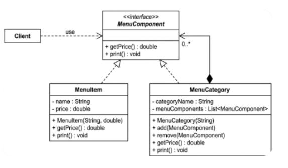

# 🍽️ Restaurant POS Menu System (Composite Pattern)

## 📌 Problem Statement
A modern restaurant POS needs to manage a **hierarchical digital menu**. Standard flat lists cannot represent real-world menus where:
* **Individual Items** (e.g., Burger) must exist alongside **Categories** (e.g., Drinks).
* **Combos/Value Meals** act as a single entry but contain multiple items.
* **Arbitrary Nesting** is required (e.g., a "Family Bundle" containing multiple "Value Meals").

The goal is to calculate the total price and print details for any menu entry—whether a single soda or a massive nested bundle—using a **uniform interface**.

---

## 🏗️ Design Solution
The **Composite Design Pattern** is used to treat individual `MenuItem` objects and `MenuCategory` compositions identically.



### Key Roles:
1. **`MenuComponent` (Interface):** Defines the common contract: `getPrice()` and `print()`.
2. **`MenuItem` (Leaf):** A basic product with a name and price.
3. **`MenuCategory` (Composite):** A container that holds a list of `MenuComponent` objects. It calculates price by recursively summing the prices of its children.

---

## ▶️ Sample Output
The system treats the "Barkada Solo Meal" category as a single component within the "Main Menu," recursively calculating the total value.

```text
--- MAIN MENU ---

--- BARKADA SOLO MEAL ---
 - Classic Burger: ₱250.00
 - Large Fries: ₱85.00
 - Root Beer: ₱60.00
 - Vanilla Sundae: ₱45.00

==============================
Total Menu Value: ₱440.00
